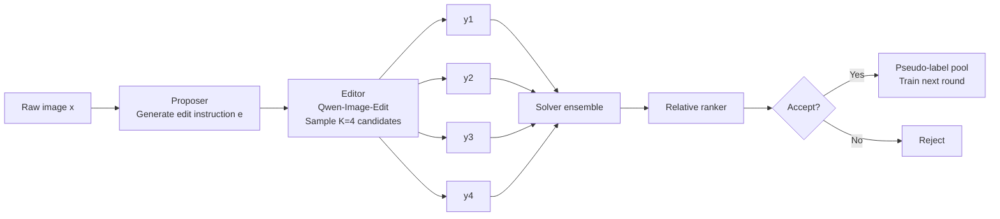

# Self-Evolving Image Editing

### Gap and claim

- Self-evolving proposer-solver training already exists for multimodal reasoning.
- RL, reward models, and edit scorers already exist for image editing.
- The missing combination is **self-evolving image editing from raw images** with a verifier that explicitly separates **requested change** from **preservation**.

### My claim

We use a `Proposer -> Editor -> Solver` loop where the editor samples multiple candidates and the solver accepts only edits that satisfy both edit success and non-edit preservation.

<small>References: [EvoLMM](https://arxiv.org/abs/2511.16672), [Self-Questioning Language Models](https://arxiv.org/abs/2508.03682), [MM-Zero](https://arxiv.org/abs/2603.09206), [InstructRL4Pix](https://arxiv.org/abs/2406.09973), [EditReward](https://arxiv.org/abs/2509.26346), [ADIEE](https://arxiv.org/abs/2507.07317)</small>

---

# Final Architecture



### Why this structure

- `Proposer`: generate **moderate-difficulty** edits
- `Editor`: sample multiple plausible outputs
- `Solver ensemble`: evaluate edit success, preservation, and localization
- `Relative ranker`: compare candidates instead of trusting one absolute score

<small>References: [EvoLMM](https://arxiv.org/abs/2511.16672), [Self-Questioning Language Models](https://arxiv.org/abs/2508.03682), [MM-Zero](https://arxiv.org/abs/2603.09206)</small>

---

# Final Reward Design

### Step 1: hard-gated feasibility

```text
G(y) = 1[S_inst(x,e,y) >= tau_inst] * 1[S_pres(x,y) >= tau_pres]
```

- `S_inst`: did the requested edit happen?
- `S_pres`: did unchanged content stay unchanged?

### Step 2: relative quality

```text
Q(y) = alpha * S_spa(x,e,y)
     + beta  * S_cf(x,e+,y,{e-})
     + gamma * S_rel(x,e,y,y_ref)
```

- `S_spa`: spatial correctness
- `S_cf`: true instruction beats distractor instructions
- `S_rel`: improvement over reference output

### Step 3: acceptance and proposer reward

```text
accept best y* only if G(y*)=1, Q(y*) >= tau_q, and solver disagreement <= delta_conf

R_prop = exp(- (u - mu)^2 / (2 * sigma^2))
```

`u` is normalized difficulty from candidate disagreement.

<small>References: [EvoLMM](https://arxiv.org/abs/2511.16672), [InstructRL4Pix](https://arxiv.org/abs/2406.09973), [SpatialReward](https://arxiv.org/abs/2602.07458), [EditReward](https://arxiv.org/abs/2509.26346), [MDPO](https://arxiv.org/abs/2406.11839)</small>

---

# Why This Could Work

### Main intuition

- A single scalar edit score is too easy to game.
- Image editing has two required objectives:
  - make the requested change
  - preserve everything else
- Hard constraints stop catastrophic compensation between reward terms.
- Relative ranking is more stable than a single absolute reward.
- Proposer difficulty shaping follows the EvoLMM learning-frontier logic.

### Main risks

- reward hacking
- proposer collapse
- solver miscalibration

### Immediate experiment ladder

1. supervised baseline  
2. naive self-training  
3. current hybrid reward  
4. final hard-gated + K-sample ranking  
5. add counterfactual reward  
6. add reference-relative reward

<small>References: [EvoLMM](https://arxiv.org/abs/2511.16672), [EditReward](https://arxiv.org/abs/2509.26346), [ADIEE](https://arxiv.org/abs/2507.07317), [SpatialReward](https://arxiv.org/abs/2602.07458), [MDPO](https://arxiv.org/abs/2406.11839)</small>
